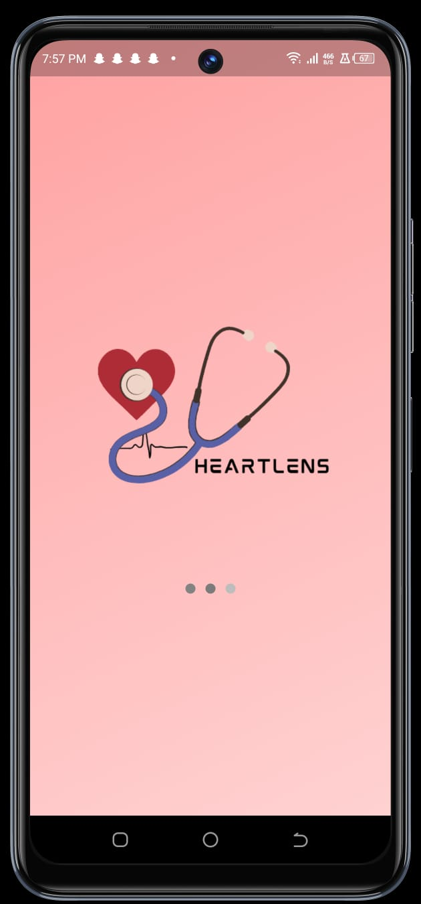
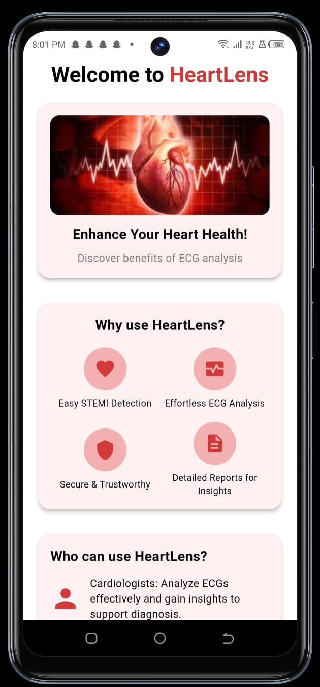
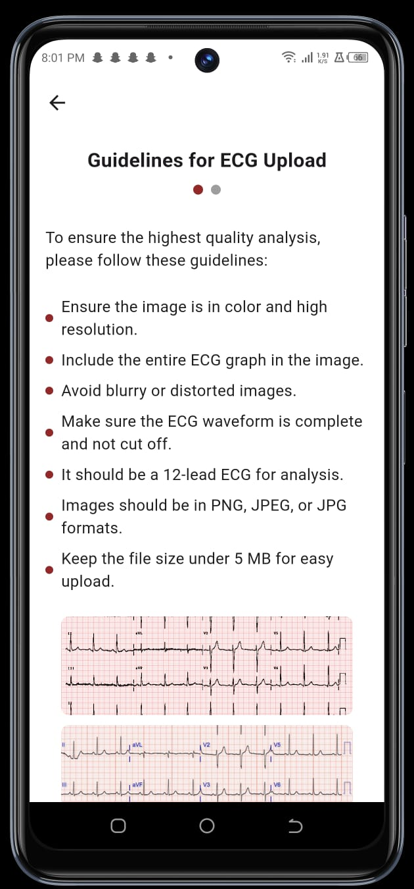
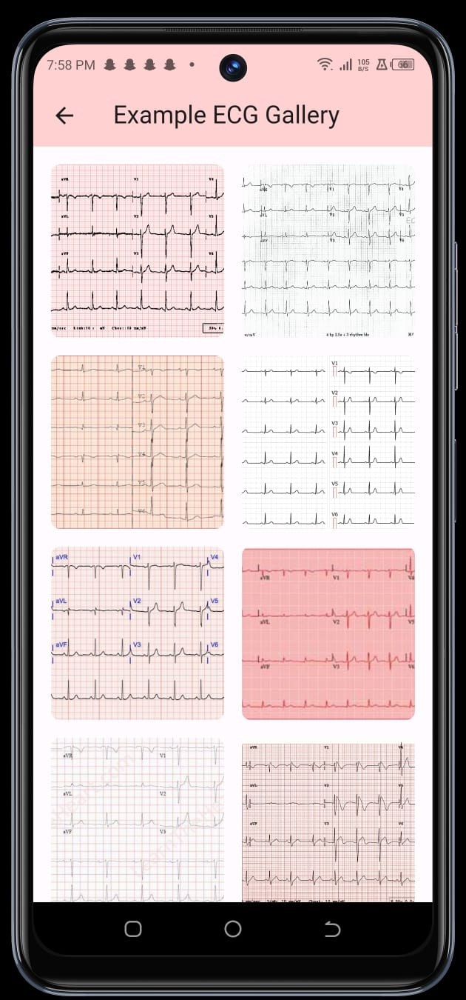
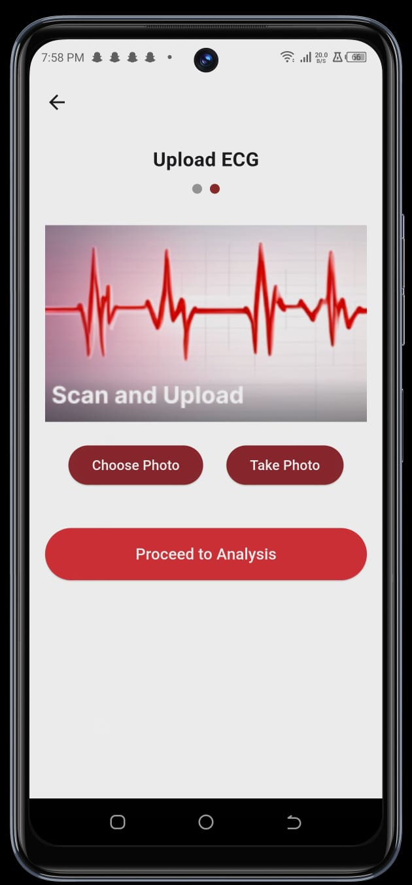
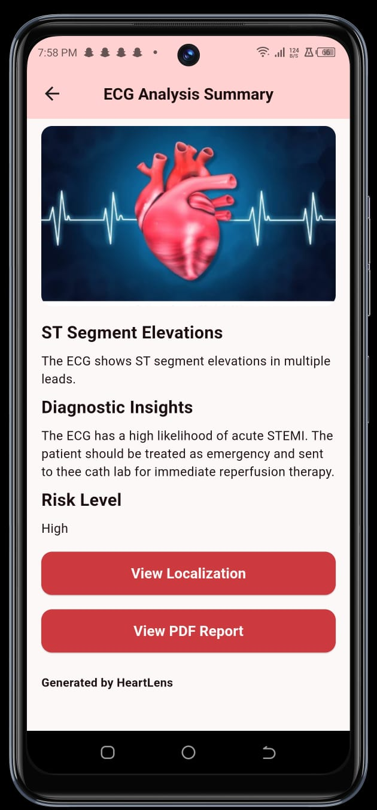

# HeartLens

HeartLens is an AI-powered mobile application designed to provide rapid and reliable detection of ST-Elevation Myocardial Infarction (STEMI) using uploaded ECG images. In emergency situations where every second counts, especially when a doctor is not immediately available, HeartLens offers critical early insights that can help save lives.

## 🚨 Problem Statement
Heart attacks are a leading cause of death globally, and timely diagnosis of STEMI is crucial for effective intervention. However, delays in diagnosis—especially in underserved or remote areas—can result in serious consequences. Patients and frontline healthcare professionals need a tool to bridge this critical time gap.

## 💡 Our Solution
HeartLens empowers users to upload or capture an ECG report via their smartphone. Using deep learning models trained to detect STEMI and localize affected regions of the heart, the app provides near-instant diagnostic predictions and generates a detailed PDF report. This allows users and general practitioners to take prompt action before specialized care arrives.

## 👨‍⚕️ Target Audience
- **General Public**: Individuals seeking preliminary diagnosis in emergency or remote situations.
- **General Practitioners & Healthcare Professionals**: For use in clinics or primary care setups to support early decision-making.

## 📱 Features
- **ECG Upload**: Capture or upload an ECG report directly through the app.
- **STEMI Detection**: AI-powered analysis to determine the presence of STEMI.
- **Localization**: Highlights the region of the heart affected.
- **PDF Report Generation**: Generates detailed diagnostic insights and recommendations in a downloadable PDF format.
- **User-Friendly Interface**: Intuitive screens with clear instructions and sample guides.

## 🛠️ Tools & Technologies
- **Frontend**: Flutter (Dart)
- **Backend**: Firebase (Firestore, Storage)
- **AI Models**: Trained on annotated ECG datasets for STEMI detection and localization.

## 🖼️ Screenshots

  
  

<b>Splash Screen</b> &nbsp;&nbsp;&nbsp; <b>Home Screen</b>

  
  

<b>ECG Upload Guidelines</b> &nbsp;&nbsp;&nbsp; <b>Example ECG Gallery</b>

  
  

<b>ECG Upload</b> &nbsp;&nbsp;&nbsp; <b>STEMI Results</b>

  

<b>PDF Report</b>

> Note: All screenshots are from the prototype version of the HeartLens app and are subject to change.

## 🚀 Getting Started (Coming Soon)
We’re actively developing HeartLens and will be sharing instructions on how to run the app locally and contribute to the project.

## 📬 Contact
Have questions, ideas, or want to collaborate? Reach out to us.
